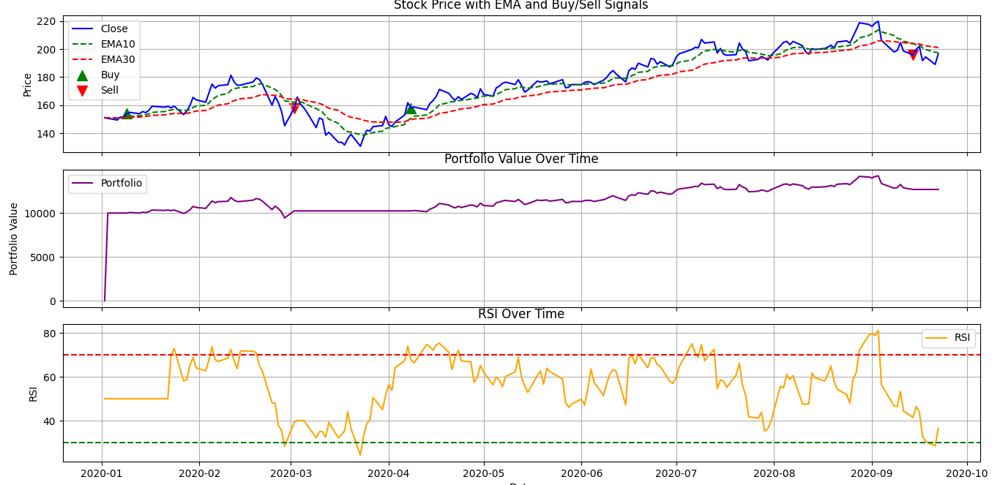

# Quantitative Trading Strategy Simulator

An **automated C++ and Python-based backtesting system** that simulates quantitative trading strategies using historical stock data.  
This project integrates **data retrieval, strategy backtesting, and visualization** into one end-to-end pipeline.

---

## 🚀 Features
- **Automated Data Download**  
  Fetches historical stock data directly from **Yahoo Finance** via Python scripts.  

- **Customizable Parameters**  
  User inputs stock symbol, date range, and technical indicator settings (e.g., Moving Averages).  

- **Trading Strategy Simulation**  
  Implements **Exponential Moving Average (EMA) crossover** and **RSI** to generate **BUY/SELL signals**.  

- **Backtesting**  
  Simulates portfolio performance based on generated signals.  

- **Visualization**  
  Automatically plots stock price, indicators, and trading signals in a single chart using Python scripts.  

---

## 🛠 Tools & Technologies
- **C++**
- **Python**
- **Pandas**
- **Matplotlib**
- **yfinance**

---

## 📂 Project Structure
```
project/
│── main.cpp               # Entry point of the C++ program
│── include/                # Core logic modules
│   ├── StockData.h   # Handles stock data loading
│   ├── Indicators.h  # Implements MA & RSI indicators
│   ├── Backtest.h    # Trading logic & backtesting
│   ├── Utils.h       # Python integration utilities
│── src/
│   ├── StockData.cpp   # Handles stock data loading
│   ├── Indicators.cpp  # Implements MA & RSI indicators
│   ├── Backtest.cpp    # Trading logic & backtesting
│   ├── Utils.cpp       # Python integration utilities
│   
│── download_data.py   # Downloads stock data using yfinance
│── plot_results.py    # Visualizes signals & portfolio
│── data/                  # Stores downloaded stock data
│── output/                # Stores results & plots
│── README.md
```

---

## ⚙️ Installation & Setup
### Prerequisites
- **C++17 or higher** (tested with GCC, MinGW, MSVC)  
- **Python 3.8+** with required libraries:
  ```bash
  pip install pandas matplotlib yfinance
  ```

### Compilation
If headers and sources are in the `header/` folder:
```bash
g++ main.cpp header/*.cpp -Iheader -o backtest
```

---

## ▶️ Usage
Run the compiled program:
```bash
./backtest
```

You’ll be prompted to enter:
- Stock symbol (e.g., `AAPL`, `MSFT`)  
- Data period (e.g., `1d`, `1wk`, `1mo`)  
- Start date (`YYYY-MM-DD`)  
- End date (optional, defaults to today)  
- Short-term and long-term EMA lengths  

### Pipeline Workflow
1. Downloads stock data → `data/`  
2. Runs backtesting with the chosen strategy  
3. Saves results → `output/portfolio_results.csv`  
4. Generates visualization → `output/plot.png`  

---

## 📊 Example Output
- **CSV File:** Portfolio performance with signals and indicators.  
- **Plot:** Stock price, moving averages, RSI, and BUY/SELL markers.  

---

## 🔮 Future Improvements
- Add support for more technical indicators (MACD, Bollinger Bands).  
- Implement multiple trading strategies for comparison.  
- Extend to real-time data feeds and paper trading.  
- Integrate deep learning methods for predictive modeling.  

---

## 📌 Author
**Arnab Singha**  
📧 [arnabsingha200228@gmail.com](mailto:arnabsingha200228@gmail.com)  
🌐 [Portfolio](https://arnabsingha200228.github.io/)
